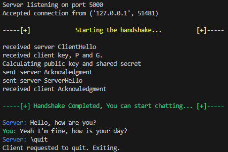
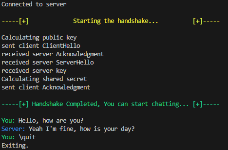

# Chat Application

This is a simple chat application implemented in Python.

## Installation
For using the programing you need the following packages:
- cryptography
- sympy

*For installing the packages*
```bash
pip install -r requirements.txt
```

# Usage


## Server
The server script listens for incoming connections. Once a connection is made with a client it will initialise a handshake. The client will calculate the initial P, G and IV for the diffie helman key exchange and AES encryption. 
The server will by default run on 127.0.0.1:5000.

*For starting the server*
```bash
python3 ./server.py
```



## Chat
The Client script tries to connect to the server. Once connected it will initialise a handhsake. The client will calculate the initial P, G and IV for the Diffie Kelman key exchange and AES encryption. 
The client will by default connect to 127.0.0.1:5000.

*For starting the client*
```bash
python3 ./client.py
```


# Functions
- AES Encryption with CBF mode
- Diffie Hellman Key exchange
- Large Prime Bits for security
- Connection between server and client
- Connection handshake for initialsing encryption